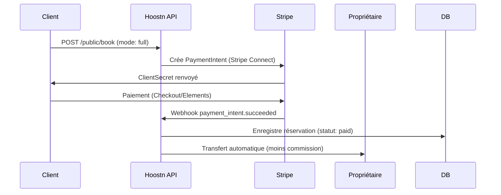
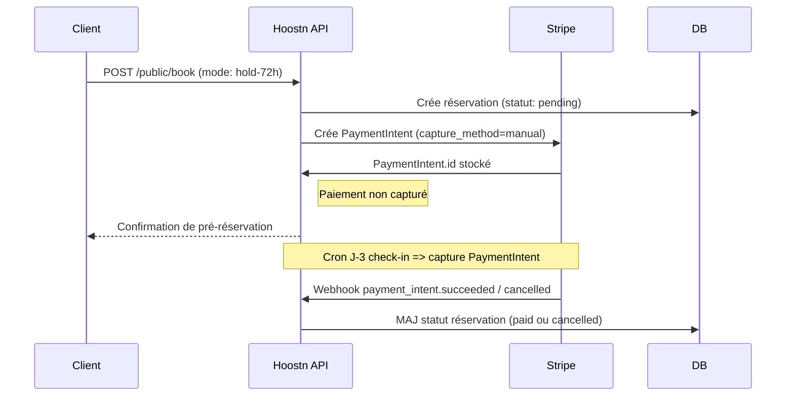

# 💳 **Plan de paiement – Stripe Connect pour Hoostn.com**

Version : 1.0 — Novembre 2025
Rédigé pour : **Hoostn.com (SaaS de gestion de locations saisonnières)**
Statut : Document de référence technique et fonctionnel

---

## 1️⃣ Objectif général

Permettre à **Hoostn.com** de gérer les **paiements entre voyageurs et propriétaires** via **Stripe Connect** tout en :

* garantissant la **séparation des fonds**,
* respectant la **réglementation financière** (KYC Stripe),
* permettant la **facturation automatique** et les **remboursements partiels**,
* intégrant les **deux modes de réservation** :
  **(a)** paiement intégral immédiat ; **(b)** réservation gratuite jusqu’à 72 h avant l’arrivée.

---

## 2️⃣ Architecture de paiement

```mermaid
flowchart LR
  A[Voyageur] -->|Paiement CB| B(Stripe Checkout / Elements)
  B -->|PaymentIntent| C[Stripe Connect Platform – Hoostn]
  C -->|Transfer| D[Compte Connecté du Propriétaire]
  C -->|Fee| E[Compte Hoostn (Commission SaaS)]
  C -->|Webhook| F[API Hoostn /api/webhooks/stripe]
  F -->|Update DB| G[(Supabase – reservation, payment_intent, facture)]
```

**Rôles**

* **Hoostn** : *Platform Account (Connect Platform)*
* **Propriétaire/Gestionnaire** : *Connected Account (Standard ou Express)*
* **Voyageur** : *Customer Stripe*

---

## 3️⃣ Typologie de comptes Stripe

| Type                         | Usage                                                                | Justification                               |
| ---------------------------- | -------------------------------------------------------------------- | ------------------------------------------- |
| **Stripe Connect Express**   | Compte recommandé pour les propriétaires individuels / conciergeries | Simplicité de création, KYC géré par Stripe |
| **Stripe Connect Standard**  | Pour agences disposant déjà d’un compte Stripe                       | Autonomie et reporting complet              |
| **Compte Plateforme Hoostn** | Centralise les paiements et commissions SaaS                         | Responsable légal des flux                  |

---

## 4️⃣ Flux de paiement selon le mode de réservation

### A. Paiement intégral immédiat



* Le paiement est capturé immédiatement.
* Le **transfert** vers le propriétaire est exécuté en J+1 (ou configurable).
* Une **commission Hoostn** est prélevée avant transfert (voir section 8).

---

### B. Réservation gratuite jusqu’à 72 h avant l’arrivée



* Aucun débit immédiat, seulement un **pré-enregistrement**.
* Si non confirmé 72 h avant check-in : la réservation est automatiquement annulée.
* Le client reçoit un rappel e-mail/SMS avant la capture.

---

## 5️⃣ Données Stripe dans Supabase

| Table            | Champs clés                                                                             |
| ---------------- | --------------------------------------------------------------------------------------- |
| `payment_intent` | id, reservation_id, stripe_payment_intent_id, status, amount, currency, provider_meta   |
| `reservation`    | id, lot_id, statut (`pending`, `paid`, `cancelled`), mode_paiement (`full`, `hold-72h`) |
| `facture`        | id, reservation_id, total, devise, pdf_url                                              |
| `audit_log`      | actor_id, action="stripe_webhook", meta=payload                                         |

---

## 6️⃣ Webhooks Stripe

| Événement                       | Action Hoostn                                           |
| ------------------------------- | ------------------------------------------------------- |
| `payment_intent.succeeded`      | MAJ `reservation.statut = paid`, génération facture PDF |
| `payment_intent.payment_failed` | Annulation automatique si non confirmé sous 24 h        |
| `payment_intent.canceled`       | Libération disponibilité (lot)                          |
| `charge.refunded`               | MAJ statut = refunded + création facture d’avoir        |
| `transfer.paid`                 | Confirmation du paiement propriétaire                   |
| `payout.failed`                 | Notification support Hoostn                             |

Webhook unique :
`POST https://api.hoostn.com/v1/webhooks/stripe`

---

## 7️⃣ Gestion des dépôts de garantie (optionnel)

| Étape | Description                                                                 |
| ----- | --------------------------------------------------------------------------- |
| 1     | Création d’un **PaymentIntent “setup_future_usage”** lors de la réservation |
| 2     | Montant bloqué 24 h avant l’arrivée (ex. 200 €)                             |
| 3     | Déblocage automatique 48 h après le check-out si aucun dommage signalé      |
| 4     | Si dommages : capture partielle ou totale (Stripe capture)                  |
| 5     | Notification client + facture mise à jour                                   |

---

## 8️⃣ Commissions et frais de service

| Type de frais                    | Montant                                      | Description                               |
| -------------------------------- | -------------------------------------------- | ----------------------------------------- |
| **Commission plateforme Hoostn** | 5 % TTC                                      | prélevée automatiquement avant transfert  |
| **Frais Stripe Connect**         | env. 1,4 % + 0,25 € (EU)                     | selon carte / devise                      |
| **Abonnement SaaS**              | 10 €/lot/mois                                | facturé séparément via Stripe Billing     |
| **Remboursement**                | –                                            | sans frais supplémentaires pour le client |
| **Rétrocession au propriétaire** | Montant – (frais Stripe + commission Hoostn) |                                           |

---

## 9️⃣ Flux de facturation

### A. Facture client (voyageur)

* Générée automatiquement au paiement (`payment_intent.succeeded`).
* Contient : logement, dates, nombre de nuits, montant, frais, taxes, total TTC.
* PDF hébergé sur **Supabase Storage**, lien dans l’espace client.

### B. Facture propriétaire (reversement)

* Générée lors du transfert Stripe Connect (`transfer.paid`).
* Mentionne la commission Hoostn et le net reçu.

### C. Facture SaaS (abonnement)

* Gérée par **Stripe Billing** (abonnement mensuel par lot).

---

## 🔟 Remboursements et annulations

| Scénario                 | Action                                 | Délai            |
| ------------------------ | -------------------------------------- | ---------------- |
| Annulation avant 72 h    | Paiement non capturé → auto-annulation | Instantané       |
| Annulation après capture | Remboursement partiel/total Stripe     | 5–10 jours       |
| Incident logement        | Remboursement manuel Hoostn            | Sur vérification |
| Erreur technique         | Stripe refund automatique via webhook  | Instantané       |

Les remboursements créent une **facture d’avoir** (enregistrée dans `facture`).

---

## 11️⃣ Sécurité et conformité

| Domaine            | Mesures                                                               |
| ------------------ | --------------------------------------------------------------------- |
| **PCI DSS**        | Aucun stockage carte sur Hoostn, tout passe par Stripe                |
| **RGPD**           | Stripe = sous-traitant conforme (DPA UE)                              |
| **Chiffrement**    | TLS 1.3 / AES-256                                                     |
| **Logs sensibles** | Exclure toute donnée carte / IBAN                                     |
| **KYC**            | Stripe Connect gère automatiquement la vérification des propriétaires |
| **Payouts**        | Transferts sécurisés (SEPA) vers comptes vérifiés                     |

---

## 12️⃣ Intégration technique (Next-Forge / API Hoostn)

### a. Création du paiement

```ts
POST /public/book
{
  "mode": "full",
  "lot_id": "...",
  "checkin": "2025-12-10",
  "checkout": "2025-12-15",
  "guests": { "adults": 2 },
  "customer": { "email": "john@doe.com" }
}
→ renvoie stripe_client_secret
```

### b. Frontend (Checkout ou Elements)

```js
import { loadStripe } from "@stripe/stripe-js";
const stripe = await loadStripe(process.env.NEXT_PUBLIC_STRIPE_KEY);
await stripe.confirmCardPayment(clientSecret);
```

### c. Webhook backend

```ts
import Stripe from "stripe";
const stripe = new Stripe(process.env.STRIPE_SECRET_KEY);

export async function POST(req) {
  const sig = req.headers.get("stripe-signature");
  const event = stripe.webhooks.constructEvent(await req.text(), sig, process.env.STRIPE_WEBHOOK_SECRET);
  switch (event.type) {
    case "payment_intent.succeeded":
      // update reservation + facture
      break;
    case "charge.refunded":
      // mark reservation refunded
      break;
  }
}
```

---

## 13️⃣ Tableau de bord Stripe

### Sections principales à activer :

* **Connect → Accounts** : suivi des propriétaires
* **Payments → Intents / Charges** : gestion flux clients
* **Transfers** : reversements propriétaires
* **Balance Transactions** : réconciliation financière
* **Billing** : abonnements SaaS Hoostn

### Webhooks requis :

| Événement                       | Activé |
| ------------------------------- | ------ |
| `payment_intent.succeeded`      | ✅      |
| `payment_intent.payment_failed` | ✅      |
| `payment_intent.canceled`       | ✅      |
| `charge.refunded`               | ✅      |
| `transfer.paid`                 | ✅      |
| `payout.failed`                 | ✅      |

---

## 14️⃣ Tableau récapitulatif des délais

| Type d’action               | Délai / moment                  |
| --------------------------- | ------------------------------- |
| Paiement immédiat           | Capture instantanée             |
| Réservation 72 h            | Capture auto J-3 avant check-in |
| Reversement propriétaire    | J+1 après paiement              |
| Remboursement client        | 5–10 jours ouvrés               |
| Déblocage dépôt de garantie | 48 h après check-out            |
| Facture client              | Générée instantanément          |
| Facture propriétaire        | Après reversement validé        |

---

## 15️⃣ Exemple de calcul de flux

**Exemple :** 5 nuits à 120 €/nuit, frais ménage 40 €, taxe séjour 10 €.
**Total client** : 650 € TTC.

* Stripe : 1,4 % + 0,25 € = 9,35 €
* Hoostn (5 %) : 32,5 €
* Propriétaire reçoit : 608,15 €
  → reversement automatique sur compte Connect.

---

## 16️⃣ Logs et audit

Tous les événements Stripe → enregistrés dans `audit_log` :

```json
{
  "actor_id": null,
  "action": "stripe_webhook",
  "target": "payment_intent.succeeded",
  "meta": {
    "intent_id": "pi_1234",
    "amount": 65000,
    "currency": "eur",
    "customer_email": "john@doe.com"
  },
  "ts": "2025-11-11T09:22:00Z"
}
```

---

## 17️⃣ SLA et surveillance

| Élément             | SLA cible        | Supervision       |
| ------------------- | ---------------- | ----------------- |
| Paiement Stripe     | 99,9 %           | Stripe Status API |
| Webhook Hoostn      | 99 %             | Pingdom / Logtail |
| Reversement Connect | 100 % validé     | Stripe Dashboard  |
| Remboursement       | < 2 h traitement | Automatisé        |

---

## ✅ Résumé opérationnel

| Étape                    | Responsable      | Outil                |
| ------------------------ | ---------------- | -------------------- |
| Création de paiement     | API Hoostn       | Stripe Connect       |
| Capture automatique      | Cron Hoostn      | Stripe PaymentIntent |
| Remboursement            | API Hoostn       | Stripe Refund        |
| Reversement propriétaire | Stripe           | Payout SEPA          |
| Facture PDF              | Supabase Storage | Automatique          |
| Audit RGPD               | Hoostn           | Logtrail             |
