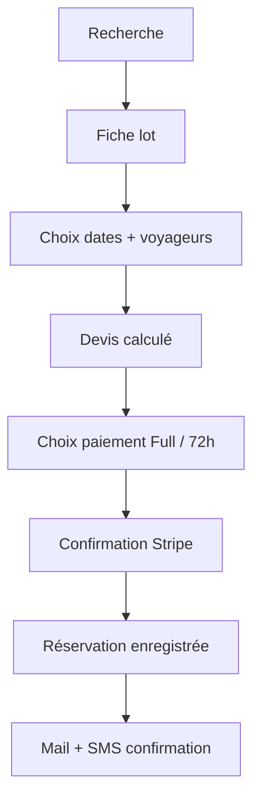
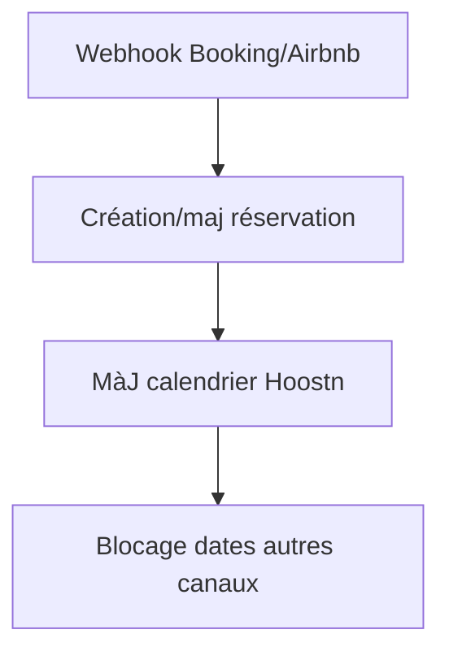
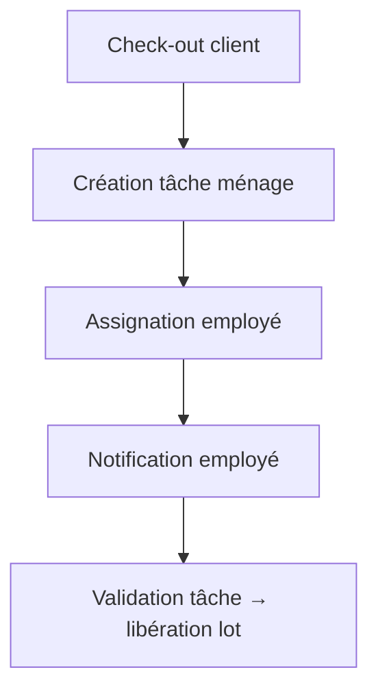
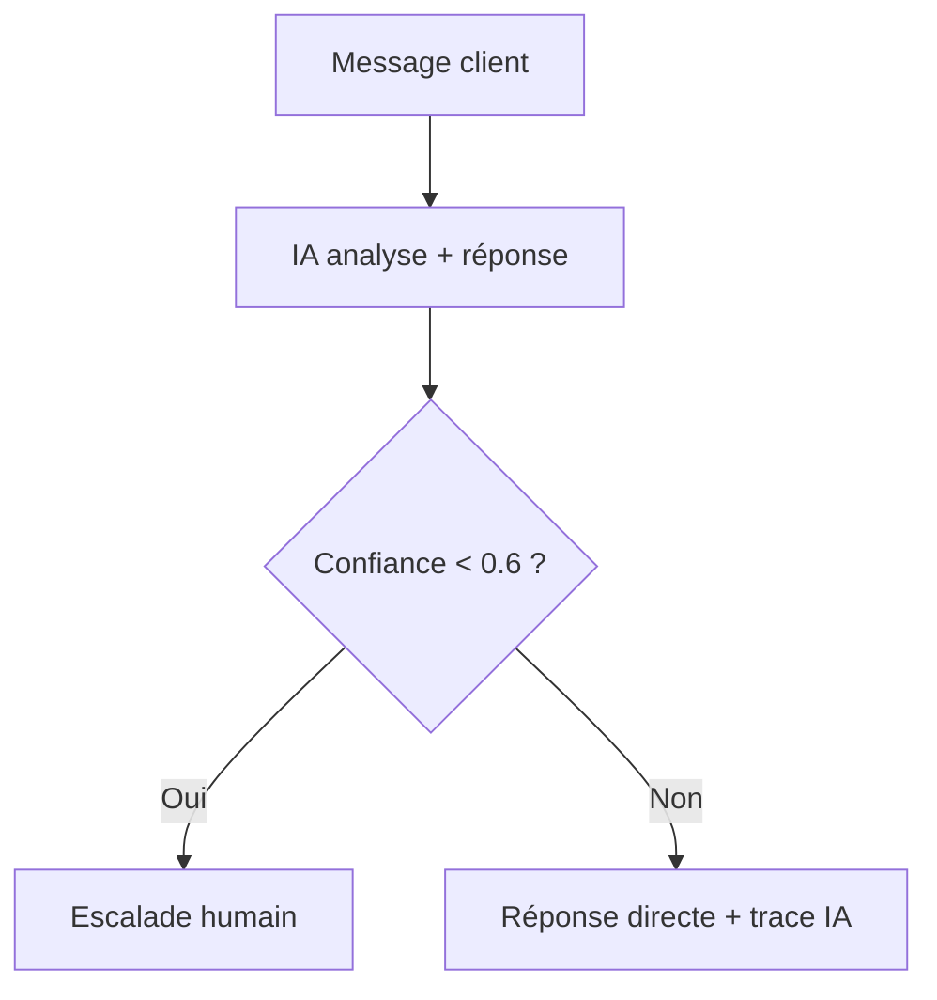

# Cahier des charges fonctionnel (V1)

### Objectif

Définir l’ensemble des fonctionnalités de la V1 Hoostn : gestion multi-biens, synchronisation OTA, réservation directe, messagerie, paiements et automatisations.

### 1. Modules principaux

| Module                               | Description                                                                    |
| ------------------------------------ | ------------------------------------------------------------------------------ |
| **Authentification Supabase**        | Magic link (email) + rôles : `guest`, `owner`, `employee`, `admin`.            |
| **Gestion des biens**                | CRUD : titre, photos, équipements, tarifs, taxe, calendrier, règles.           |
| **Calendrier**                       | Vue mensuelle par lot, synchronisation API Booking/Airbnb, iCal import/export. |
| **Réservations**                     | Centralisation OTA + direct, statut (`pending`, `paid`, `cancelled`).          |
| **Paiement Stripe Connect**          | Mode `full` ou `hold-72h` (capture différée).                                  |
| **Messagerie centralisée**           | Intégration Airbnb/Booking + chat IA (Gemini/OpenRouter) + HITL.               |
| **Tableau de bord analytique**       | KPIs : revenus, taux d’occupation, top biens.                                  |
| **Interface publique (marketplace)** | Recherche par localisation, filtres, fiche lot, réservation directe.           |
| **Gestion du personnel**             | Planning ménage, tâches, stocks produits d’entretien.                          |
| **Notifications**                    | Emails transactionnels + SMS informatifs.                                      |
| **Paramètres**                       | Organisation, taxes, langues, devises, RGPD.                                   |

### 2. Rôles et accès

| Rôle                                    | Accès principal                                              |
| --------------------------------------- | ------------------------------------------------------------ |
| **Voyageur (guest)**                    | Interface publique, réservation, messagerie.                 |
| **Propriétaire / gestionnaire (owner)** | Backoffice : lots, réservations, communication, facturation. |
| **Employé (employee)**                  | Tableau des ménages, tâches, checklist matériel.             |
| **Admin Hoostn**                        | Supervision multi-organisations, logs, gestion API.          |

### 3. Contraintes techniques

* Stack : Next.js (Next-Forge) + Supabase + Vercel + Zustand.
* Temps réel : Supabase Realtime + WebSocket fallback SSE.
* RGPD UE (hébergement, consentement).
* Design responsive (desktop-first, mobile web-friendly).

---

## 📋 `2.2_user_stories_mvp.md` — User Stories / Backlog MVP

### Format :

> “En tant que [rôle], je veux [action] afin de [objectif].”

#### Authentification

* En tant que propriétaire, je veux me connecter via un lien email sans mot de passe.
* En tant que voyageur, je veux pouvoir créer un compte après une réservation.

#### Gestion des biens

* En tant que propriétaire, je veux ajouter un nouveau bien avec photos, tarifs et équipements.
* En tant que propriétaire, je veux synchroniser automatiquement mes calendriers avec Airbnb et Booking.

#### Réservation

* En tant que voyageur, je veux rechercher un bien par ville, dates et nombre de personnes.
* En tant que voyageur, je veux réserver directement depuis Hoostn avec paiement en ligne.
* En tant que propriétaire, je veux bloquer des dates manuellement.

#### Paiement / Annulation

* En tant que propriétaire, je veux choisir entre paiement immédiat ou 72h avant arrivée.
* En tant que voyageur, je veux annuler sans frais jusqu’à 72h avant arrivée.

#### Messagerie & IA

* En tant que propriétaire, je veux centraliser tous les messages clients depuis les OTA.
* En tant que client, je veux discuter avec une IA qui connaît ma réservation.
* En tant que support, je veux pouvoir reprendre la main sur une conversation.

#### Employés

* En tant qu’employé, je veux visualiser les ménages à faire pour la semaine.
* En tant que propriétaire, je veux assigner des tâches ménage automatiquement à chaque check-out.

#### Analytique

* En tant que propriétaire, je veux suivre le taux d’occupation et mes revenus par mois.

#### Notifications

* En tant que voyageur, je veux recevoir un SMS de rappel avant mon arrivée.
* En tant que propriétaire, je veux recevoir une alerte en cas de double réservation détectée.

---

## 🧭 `2.3_arborescence_parcours.md` — Arborescence & Parcours utilisateurs

### 1. Pages publiques

```
/              → Landing page
/explorer      → Recherche (ville, dates, filtres)
/lot/[slug]    → Fiche lot
/reserver      → Tunnel de réservation (4 étapes)
/login         → Connexion magic link
/about         → À propos
/cgu, /confidentialite, /mentions-legales
```

### 2. App propriétaire / gestionnaire

```
/app/dashboard
/app/lots
/app/reservations
/app/messagerie
/app/employes
/app/parametres
```

### 3. App employé

```
/app/emplois
/app/menages
/app/checklists
```

### 4. Parcours typiques

**Voyageur :**
Recherche → Fiche lot → Sélection dates → Réservation → Paiement → Confirmation
**Propriétaire :**
Connexion → Dashboard → Gestion des biens → Messagerie / Planning
**Employé :**
Invitation → Tableau tâches → Validation nettoyage

---

## 🧱 `2.4_wireframes_uxflows.md` — Wireframes & UX Flows

### 1. Écrans clés

* Page d’accueil (hero + recherche)
* Page /explorer (carte + filtres latéraux)
* Fiche lot (photos, infos, disponibilité, CTA)
* Tunnel réservation (étapes : infos > paiement > confirmation)
* Dashboard propriétaire (revenus, taux d’occupation)
* Chat IA (avec escalade HITL)
* Interface employé (planning ménages)

### 2. Flux principaux



### 3. UX guidelines

* CTA primaire = bleu Hoostn (`#1F3A8A`)
* Feedback immédiat après action
* Layout en colonnes larges, cards arrondies (16 px)
* Accessibilité : WCAG 2.1 AA

---

## 🔍 `2.5_recherche_filtres.md` — Spécifications recherche & filtres

### 1. Champs de recherche

| Champ        | Type                     | Source                    |
| ------------ | ------------------------ | ------------------------- |
| Localisation | texte (ville / quartier) | Table `lots.address.city` |
| Dates        | range                    | `reservations`            |
| Voyageurs    | int                      | input                     |
| Chambres     | int                      | `lots.rooms`              |
| Animaux      | bool                     | `lots.pets_allowed`       |

### 2. Filtres additionnels

* Prix min/max
* Type de logement
* Équipements (wifi, piscine, parking, etc.)

### 3. Exemple requête SQL (Supabase)

```sql
SELECT *
FROM lots
WHERE city ILIKE '%paris%'
  AND capacity_adults >= 2
  AND rooms >= 1
  AND pets_allowed = true
  AND id NOT IN (
    SELECT lot_id FROM reservations
    WHERE daterange(checkin, checkout, '[]') && daterange('2025-08-10', '2025-08-15', '[]')
  )
ORDER BY nightly_rate ASC
LIMIT 50;
```

### 4. SEO

* Routes SSR : `/ville/quartier`
* Schema.org : `LodgingBusiness` + `Offer`.

---

## 💳 `2.6_paiement_annulation.md` — Règles de paiement et annulation

| Cas                                | Mode “Full”                             | Mode “Hold-72h”                                        |
| ---------------------------------- | --------------------------------------- | ------------------------------------------------------ |
| **Au moment de la réservation**    | Paiement intégral par carte via Stripe. | Réservation enregistrée sans capture, empreinte posée. |
| **72h avant arrivée**              | Aucun changement.                       | Capture automatique du montant total.                  |
| **Annulation > 72h avant arrivée** | Remboursement total.                    | Pas de paiement, réservation annulée.                  |
| **Annulation < 72h avant arrivée** | Remboursement partiel selon politique.  | Capture + retenue éventuelle selon règles.             |
| **No-show / départ anticipé**      | Non remboursé.                          | Non remboursé.                                         |

> Les taxes et frais de ménage ne sont jamais remboursables après capture.

---

## ⚙️ `2.7_workflows_automatismes.md` — Workflows automatisés (BPMN simplifié)

### 1. Réservation directe

```mermaid
flowchart TD
  A[Réservation créée] --> B[Devis calculé]
  B --> C[Stripe PaymentIntent créé]
  C --> D{Mode = Full ?}
  D -- Oui --> E[Capture immédiate]
  D -- Non --> F[Empreinte posée]
  F --> G[Job capture 72h avant check-in]
  E & G --> H[Confirmation client (Email+SMS)]
```

### 2. Synchronisation OTA



### 3. Ménages



### 4. Messagerie IA + HITL



### 5. Facturation & reporting

* Job quotidien → génération factures PDF + envoi automatique.
* Job mensuel → agrégation revenus / taux d’occupation / charges.