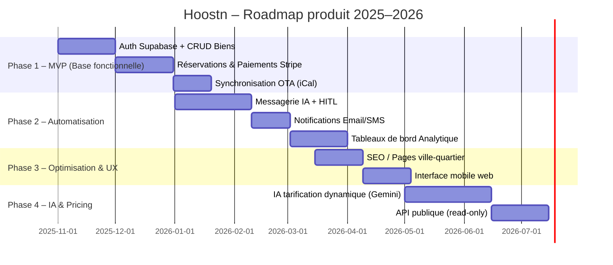
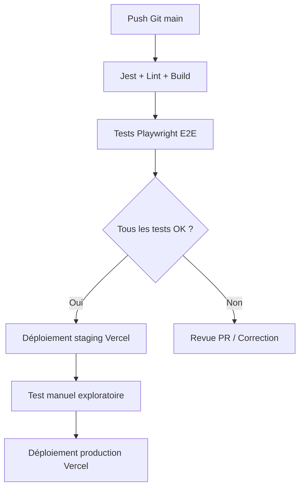

# Roadmap Produit (6–12 mois)

### 🎯 Objectif

Planifier les phases de développement du produit Hoostn, du MVP jusqu’à la stabilisation complète (V1.2).

---

## 📅 Vue synthétique (Gantt simplifié)



---

## 🔑 Jalons clés

| Date cible     | Version | Contenu                                |
| -------------- | ------- | -------------------------------------- |
| **Janv. 2026** | v1.0.0  | MVP complet (OTA + Stripe + Dashboard) |
| **Mars 2026**  | v1.1.0  | IA + HITL + SEO pages dynamiques       |
| **Juin 2026**  | v1.2.0  | IA Pricing + API publique + UX mobile  |

---

# `/docs/dev/8.2_plan_test_qa.md` — Plan de test & QA

### 🎯 Objectif

Garantir la qualité fonctionnelle, la sécurité et la performance de Hoostn avant chaque release.

---

## 🧪 Types de tests

| Type                  | Outil      | Fréquence         | Objectif                     |
| --------------------- | ---------- | ----------------- | ---------------------------- |
| **Unitaires**         | Jest       | à chaque build    | Vérifier logique métier      |
| **Intégration API**   | Supertest  | à chaque PR       | Vérifier endpoints REST      |
| **E2E (front + API)** | Playwright | nightly / préprod | Vérifier parcours complet    |
| **Performance**       | k6         | trimestriel       | Mesurer temps réponse API    |
| **Sécurité**          | OWASP ZAP  | semestriel        | Scan vulnérabilités          |
| **Accessibilité**     | axe-core   | CI/CD             | Vérifier conformité WCAG 2.1 |

---

## 🔄 Pipeline QA (CI/CD)



---

## 🧾 Exemple de scénario E2E (Playwright)

```js
test('Reservation directe - paiement réussi', async ({ page }) => {
  await page.goto('/explorer');
  await page.click('text=Paris 11e');
  await page.click('text=Appartement Cosy');
  await page.click('text=Réserver');
  await page.fill('#dates', '2025-12-12 au 2025-12-15');
  await page.click('text=Payer maintenant');
  await expect(page.locator('text=Merci pour votre réservation')).toBeVisible();
});
```

---

# `/docs/dev/8.3_plan_deploiement_ci_cd.md` — Plan de déploiement CI/CD

### 🎯 Objectif

Automatiser les builds, migrations, tests et déploiements sur Vercel & Supabase.

---

## 🧱 Architecture CI/CD

| Étape                  | Outil              | Action                               |
| ---------------------- | ------------------ | ------------------------------------ |
| 1. Build & test        | GitHub Actions     | Lancement Jest + ESLint + Playwright |
| 2. Migration DB        | Supabase CLI       | `supabase db push`                   |
| 3. Déploiement staging | Vercel             | Prévisualisation par PR              |
| 4. QA manuelle         | URL preview        | Vérification manuelle                |
| 5. Production          | Vercel auto-deploy | Trigger sur `main` validée           |

---

## ⚙️ Exemple `.github/workflows/deploy.yml`

```yaml
name: CI/CD Hoostn
on:
  push:
    branches: [main, staging]
jobs:
  build-test-deploy:
    runs-on: ubuntu-latest
    steps:
      - uses: actions/checkout@v4
      - name: Install dependencies
        run: npm ci
      - name: Lint + Test
        run: npm run lint && npm run test
      - name: Migrate Supabase
        run: npx supabase db push
      - name: Deploy to Vercel
        run: npx vercel --prod --token=${{ secrets.VERCEL_TOKEN }}
```

---

# `/docs/dev/8.4_politique_versioning_changelog.md` — Politique de versioning & changelog

### 🎯 Objectif

Standardiser le suivi des versions et la communication des mises à jour.

---

## 🧩 Versioning sémantique

`vMAJEURE.MINEURE.CORRECTIVE`

* **MAJEURE** : rupture de compatibilité.
* **MINEURE** : nouvelle fonctionnalité rétrocompatible.
* **CORRECTIVE** : bugfix ou amélioration interne.

### Exemples

| Version  | Type       | Description                 |
| -------- | ---------- | --------------------------- |
| `v1.0.0` | Initiale   | MVP complet OTA + Stripe    |
| `v1.1.0` | Mineure    | Chat IA + SEO pages         |
| `v1.1.2` | Corrective | Bug iCal double réservation |

---

## 🗒️ Exemple `CHANGELOG.md`

```
# Changelog Hoostn

## [1.1.0] - 2026-03-12
### Added
- Chat IA Gemini + mode HITL
- SEO pages dynamiques (ville/quartier)
### Fixed
- Latence API Supabase réduite
```

---

# `/docs/dev/8.5_documentation_developpeurs.md` — Documentation développeurs

### 🧭 Installation locale

```bash
git clone https://github.com/hoostn/hoostn.com.git
cd hoostn.com
npm install
npx supabase start
npm run dev
```

### 🔧 Variables d’environnement

```
NEXT_PUBLIC_SUPABASE_URL=
NEXT_PUBLIC_SUPABASE_ANON_KEY=
STRIPE_SECRET_KEY=
RESEND_API_KEY=
OPENROUTER_API_KEY=
```

### 📦 Scripts utiles

| Script            | Description                      |
| ----------------- | -------------------------------- |
| `npm run dev`     | Lancer le serveur local          |
| `npm run test`    | Tests unitaires Jest             |
| `npm run build`   | Build Next.js pour Vercel        |
| `npm run db:push` | Synchroniser migrations Supabase |
| `npm run lint`    | Vérification ESLint              |

---

# `/docs/dev/8.6_support_technique_sla.md` — Support technique & SLA

### 🎯 Objectif

Garantir la qualité du support utilisateur et les délais de traitement des incidents.

---

## 📞 Canaux support

| Canal                                                 | Cible             | Délai moyen                  |
| ----------------------------------------------------- | ----------------- | ---------------------------- |
| Chat intégré (IA + HITL)                              | Tous utilisateurs | < 5 min (IA) / < 2h (humain) |
| Email [support@hoostn.com](mailto:support@hoostn.com) | Clients pro       | < 4h ouvrées                 |
| Urgences (bug production)                             | Admin             | < 1h 24/7                    |

---

## 🔔 Niveaux de sévérité

| Niveau            | Description          | Délai de réponse | Délai de résolution |
| ----------------- | -------------------- | ---------------- | ------------------- |
| **Critique (P1)** | Service indisponible | 1h               | 4h                  |
| **Majeur (P2)**   | Fonction bloquante   | 2h               | 8h                  |
| **Modéré (P3)**   | Bug non-bloquant     | 24h              | 72h                 |
| **Mineur (P4)**   | Suggestion / UI      | 48h              | N/A                 |

---

## 📈 SLA (Service Level Agreement)

* **Disponibilité cible : 99,5 % / mois**
* Surveillance via **UptimeRobot** et **Supabase metrics**
* Revue mensuelle SLA avec rapports automatiques PDF
