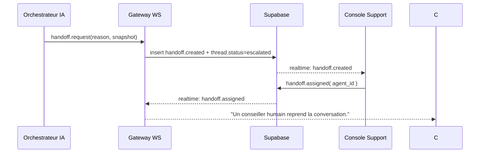

# 🧩 Architecture Chat IA Temps Réel – Hoostn.com

*Version : 1.0 – Novembre 2025*

## 0) Objectifs

* Messagerie **temps réel** entre Voyageur ⇄ IA ⇄ Propriétaire/Support.
* **HITL** fluide : bascule instantanée vers un agent humain, avec reprise/retour IA.
* **Traçabilité RGPD** : logs, consentement, rétention, anonymisation.
* **Robustesse** : dégradation élégante (SSE / polling), reprise réseau.

---

## 1) Vue d’ensemble (composants)

```mermaid
flowchart LR
  subgraph Client["Frontends"]
    U1[Public Chat Widget\n(voyageur)]
    U2[Backoffice Owner/Manager]
    U3[Console Support\n(agent humain)]
  end

  subgraph Edge["Vercel / Next-Forge"]
    GW[Gateway Temps Réel\n(WebSocket / SSE)]
    API[API REST / Tools\n/availability, /quote, /policy, /messages, /support]
    WH[Webhooks (Stripe, Booking)]
    ORCH[Orchestrateur IA\n(Gemini/OpenRouter + outils)]
  end

  subgraph DB["Supabase (UE)"]
    DB1[(Postgres + RLS)]
    RT[Supabase Realtime\n(channels)]
    ST[Storage (attachments, PDF)]
  end

  subgraph Ext["Services externes"]
    IA[LLM Providers]
    MAIL[Resend/Postmark]
    SMS[Twilio/Vonage (info-only)]
  end

  U1<-->GW
  U2<-->GW
  U3<-->GW

  GW<-->API
  API<-->DB1
  API<-->RT
  API-->ORCH
  ORCH-->IA

  API-->MAIL
  API-->SMS

  RT<-->U1
  RT<-->U2
  RT<-->U3
```

**Principes clés**

* **Transport primaire** : WebSocket. **Fallback** : SSE, puis polling.
* **Pub/Sub** : Supabase Realtime pour diffusion d’événements (threads, messages, handoff).
* **Orchestration IA** : appels outillés (quote, policy, calendar) + règles HITL.
* **Sécurité** : Supabase Auth (JWT), RLS stricte par `org_id` et visibilité par `thread_id`.

---

## 2) Modèle de données (rappel minimal)

Tables (Postgres/Supabase) utilisées par le chat :

* `thread(id, org_id, reservation_id?, channel, status, opened_by, opened_at, language, last_message_at)`
* `message(id, thread_id, author_type[in|out|agent|ia], author_id?, body, meta_json, created_at)`
* `ai_trace(id, thread_id, model, prompt_tokens, completion_tokens, latency_ms, confidence, safety_flags, created_at)`
* `handoff(id, thread_id, reason, snapshot_json, created_at, assigned_to?, resolved_at, outcome?)`
* `presence(thread_id, user_id, role, last_seen_at, typing_state)` *(optionnel : table ou channel mémoire)*

**États de `thread.status`:**
`open → waiting_ia → waiting_user → escalated → assigned → resolved → closed`

---

## 3) Canaux temps réel & événements

### 3.1 Canaux (Supabase Realtime)

* `realtime:thread:{thread_id}` — diffusion des événements liés au thread.
* `realtime:org:{org_id}:inbox` — flux agrégé pour consoles Owner/Support.

### 3.2 Événements

| Event              | Payload (extraits)                           | Émetteur        |
| ------------------ | -------------------------------------------- | --------------- |
| `message.created`  | `{ id, thread_id, author_type, body, meta }` | GW/API          |
| `thread.updated`   | `{ id, status, last_message_at }`            | API             |
| `handoff.created`  | `{ id, thread_id, reason, snapshot }`        | IA/GW           |
| `handoff.assigned` | `{ id, thread_id, assigned_to }`             | Console Support |
| `handoff.resolved` | `{ id, thread_id, outcome }`                 | Console Support |
| `presence.changed` | `{ thread_id, user_id, typing_state }`       | Clients         |

---

## 4) Séquences clés

### 4.1 Voyageur → IA (réponse fiable)

```mermaid
sequenceDiagram
  participant C as Client (Voyageur)
  participant WS as Gateway WS
  participant OR as Orchestrateur IA
  participant API as API Tools
  participant DB as Supabase (DB/Realtime)

  C->>WS: WS.send(message.new)
  WS->>DB: insert message (author=in)
  DB-->>C: realtime: message.created
  WS->>OR: invoke LLM with tools
  OR->>API: availability.quote / policy.get / calendar.check
  API->>DB: read/write as needed
  OR-->>WS: answer + confidence + actions
  WS->>DB: insert message (author=ia); insert ai_trace
  DB-->>C: realtime: message.created (ia)
```

### 4.2 Escalade HITL (confiance < 0,6 ou cas sensible)



### 4.3 Agent humain prend la main puis rend à l’IA

```mermaid
sequenceDiagram
  participant AG as Agent Support
  participant WS as Gateway WS
  participant DB as Supabase
  participant OR as Orchestrateur IA

  AG->>WS: message.new(author=agent)
  WS->>DB: insert message (agent)
  DB-->>Clients: realtime message.created
  AG->>WS: handoff.resolve(outcome)
  WS->>DB: update handoff.resolved; thread.status=waiting_user
  WS->>OR: notify resume (context updated)
  OR-->>WS: ready
```

---

## 5) API & WebSocket – Contrats

### 5.1 WebSocket (route Edge)

**URL** : `/ws/chat`
**Auth** : `Sec-WebSocket-Protocol: hoostn, Bearer <jwt>`
**Heartbeat** : ping/pong 30 s

**Message → serveur**

```json
{
  "type": "message.new",
  "thread_id": "uuid",
  "body": "Bonjour, avez-vous dispo du 10 au 15/08 ?",
  "meta": { "client_locale": "fr" }
}
```

**Réponse ← serveur (exemples)**

```json
{ "type": "ack", "message_id": "uuid" }

{ "type": "message.created", "payload": {
  "id":"uuid","thread_id":"uuid","author_type":"ia",
  "body":"Oui, je vérifie la disponibilité...",
  "meta": { "confidence": 0.93 }
}}

{ "type": "handoff.created", "payload":{
  "id":"uuid","thread_id":"uuid","reason":"policy_exception",
  "snapshot":{ "summary":"Demande de remboursement partiel...", "last_messages":[...] }
}}
```

### 5.2 REST (extraits)

* `POST /api/threads` : crée/récupère un thread.
* `GET /api/threads/{id}/messages` : pagination des messages.
* `POST /api/handoff/{id}/assign` : prise en charge par agent.
* `POST /api/handoff/{id}/resolve` : résolution + outcome.
* `POST /api/ai/respond` : endpoint interne (orchestration synchrone).

---

## 6) Orchestration IA (outillage & garde-fous)

### 6.1 Outils (adapters)

* `availability.quote` (prix total + vérification des conflits)
* `calendar.check_conflict`
* `policy.get` (annulation, dépôt de garantie)
* `messages.send` (email/in-app **seulement**)
* `support.escalate` (création handoff)

### 6.2 Garde-fous

* **Jamais** confirmer prix/dispo sans `quote` + `check_conflict=false`.
* **SMS** : *info-only*, pas de fil de discussion.
* `confidence < 0.6` → **handoff**.
* Blocage si outage d’un outil critique → message neutre + HITL.

---

## 7) Sécurité & RLS

* **Auth** : Supabase Auth (JWT) signé côté Gateway.
* **RLS** :

  * `thread.org_id = auth.org_id()`
  * `message.thread_id IN (threads visibles)`
  * Support Hoostn : rôle dédié avec accès lecture inter-org **lecture seule**.
* **Scopes** : `guest`, `owner|manager`, `agent`, `admin`.
* **PII Redaction** dans `ai_trace.meta` (emails/téléphones masqués).
* **Rate limit** : 20 msgs/min/thread (429 sur excès) + `X-Request-Id`.

---

## 8) Tolérance aux pannes & fallback

| Panne              | Fallback                                   |
| ------------------ | ------------------------------------------ |
| WS indisponible    | bascule **SSE** (`/sse/chat?thread_id`)    |
| SSE indisponible   | **polling** (5 s)                          |
| Outil IA down      | message standard + **handoff**             |
| Reconnexion client | reprise offset (dernier `message_id` reçu) |

---

## 9) Observabilité

* **Logs structurés** (`audit_log`: action, target, meta, ts).
* **Traces IA** (`ai_trace` : tokens, latence, confiance) – **rétention 30 j**.
* **Métriques** : temps médian première réponse, taux d’escalade, SLA agent.
* **Alerting** : seuils WebSocket drop rate, latence > 3 s, échecs outils > 5 %.

---

## 10) Exemples de code (TypeScript / Next-Forge)

### 10.1 Route WebSocket (`/app/api/ws/chat/route.ts`)

```ts
import { NextRequest } from "next/server";
import { verifyJwt } from "@/lib/auth";
import { upsertMessage, publishRealtime } from "@/lib/chat";
import { orchestrate } from "@/lib/ai";

export const config = { runtime: "edge" };

export default async function handler(req: NextRequest) {
  const { socket, response } = Deno.upgradeWebSocket(req);
  const token = req.headers.get("sec-websocket-protocol")?.split(",").pop()?.trim();
  const auth = await verifyJwt(token!); // throws on invalid

  socket.onmessage = async (event) => {
    const msg = JSON.parse(event.data as string);
    if (msg.type === "message.new") {
      const saved = await upsertMessage(auth, msg.thread_id, "in", msg.body);
      socket.send(JSON.stringify({ type: "ack", message_id: saved.id }));
      await publishRealtime(msg.thread_id, { type: "message.created", payload: saved });

      const ai = await orchestrate({ auth, thread_id: msg.thread_id, userText: msg.body });
      if (ai) {
        await publishRealtime(msg.thread_id, { type: "message.created", payload: ai.message });
      }
    }
  };

  socket.onclose = () => {};
  return response;
}
```

### 10.2 Client Web (widget)

```ts
const ws = new WebSocket(`${origin.replace("https","wss")}/ws/chat`, ["hoostn", `Bearer ${jwt}`]);

ws.onmessage = (ev) => {
  const evt = JSON.parse(ev.data);
  switch (evt.type) {
    case "message.created":
      renderMessage(evt.payload);
      break;
    case "handoff.created":
      showInfo("Un conseiller humain va reprendre.");
      break;
  }
};

function sendUserMessage(threadId: string, text: string) {
  ws.send(JSON.stringify({ type: "message.new", thread_id: threadId, body: text }));
}
```

### 10.3 Supabase Realtime (consoles Owner/Support)

```ts
const channel = supabase.channel(`realtime:org:${orgId}:inbox`);
channel.on("broadcast", { event: "message.created" }, (payload) => {
  inboxStore.add(payload);
});
channel.subscribe();
```

---

## 11) Console Support – UX fonctionnelle

* **Colonnes** : Non assignés / En cours / Résolus.
* **Cartes** : dernier message, raison handoff, SLA restant.
* **Actions** : “Prendre en charge”, “Répondre”, “Résoudre”, “Retour IA”.
* **Raccourcis** : templates de réponse, insertion devis, lien facture.
* **Indicateurs** : temps 1ère réponse, satisfaction, clôtures/jour.

---

## 12) RGPD & gestion des données

* **Consentement** : bannière + case “accepter assistance IA” dans widget.
* **Rétention** : `message` & `ai_trace` **30 jours** → anonymisation.
* **Droit d’accès/suppression** : outil interne (export JSON/PDF du thread).
* **PII** : hachage e-mails/téléphones dans traces IA.

---

## 13) Tests & QA (checklist)

* [ ] Débit/Crédit : 200 msg/min global → pas de perte.
* [ ] Coupure réseau client : reprise avec derniers N messages.
* [ ] Dégradation WS→SSE→polling fonctionnelle.
* [ ] Conflits de calendrier : l’IA **n’affirme jamais** sans `quote+check_conflict`.
* [ ] HITL : assignation < 2 min, metrics SLA OK.
* [ ] RGPD : anonymisation effective à J+30 (tâche CRON vérifiée).

---

## 14) Roadmap d’améliorations

* Typing indicators & “agent is writing” via channel `presence`.
* Résumés automatiques de thread (nightly) pour accélérer la reprise.
* Détection de langue côté Edge + routage modèle IA par langue.
* Notes internes côté agent (non visibles client) + tags de classification.

---

### ✅ Résumé exécutable

* **Transport** : WS avec fallback SSE.
* **Diffusion** : Supabase Realtime.
* **IA** : Orchestrateur outillé + seuil de confiance (0.6) → HITL.
* **Sécurité** : JWT + RLS par `org_id`/`thread_id`.
* **RGPD** : rétention 30 j, anonymisation, export/suppression.
